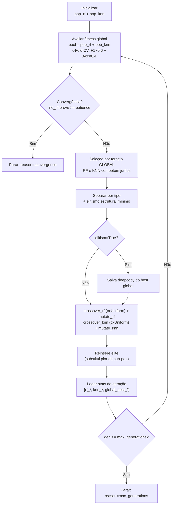
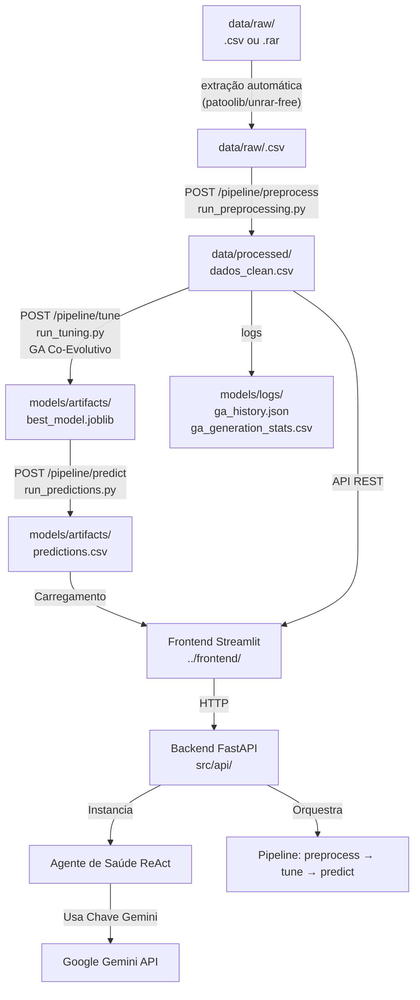

# Arquitetura do Projeto - Fase 2

Este documento descreve a arquitetura do sistema de análise e previsão de estado nutricional baseado em dados do SISVAN, detalhando a estrutura de pastas real do projeto, o fluxo do pipeline de dados e a arquitetura do agente de Inteligência Artificial para apoio clínico.

---

## 📂 Estrutura de Pastas e Componentes

A estrutura de diretórios do projeto divide-se em componentes reais (já implementados) e estruturais/planejados para as próximas entregas da Fase 2:

```
project-root/
├── README.md               # Instruções gerais de instalação e setup
├── requirements.txt        # Dependências em formato clássico txt
├── pyproject.toml          # Configurações do projeto e dependências do UV
├── uv.lock                 # Trava de dependências do UV
├── .env.example            # Modelo de configuração de ambiente
├── .gitignore              # Filtros de versionamento do Git
│
├── config/                 # Configurações centralizadas
│   └── __init__.py         # Módulo de inicialização
│
├── data/                   # Diretório de dados do pipeline
│   ├── raw/                # Base SISVAN bruta (dados originais, aceita .csv ou .rar)
│   ├── processed/          # Base processada e higienizada pós-pipeline
│   └── .gitkeep
│
├── models/                 # Diretório de artefatos de IA/ML
│   ├── artifacts/          # Modelos de Machine Learning e encoders salvos (.joblib)
│   ├── logs/               # Histórico de execução — ga_history.json, ga_generation_stats.csv
│   └── cache/              # Dados cacheados intermediários
│
├── src/                    # Código-fonte principal da aplicação
│   ├── __init__.py
│   ├── data/               # Subsistema de dados e transformação
│   │   ├── __init__.py     # Definição e exportação de funções de transformação
│   │   ├── ingest.py       # Ingestão de CSV + extração de .rar (patoolib)
│   │   ├── features.py     # Engenharia de features e codificação de categorias
│   │   └── preprocessing.py # Pipeline de pré-processamento (remoção, padronização)
│   │
│   ├── models/             # Algoritmo genético co-evolutivo e avaliação
│   │   ├── __init__.py
│   │   ├── individuo.py        # Classes Individuo (ABC), IndividuoRF, IndividuoKNN
│   │   ├── ga_operators.py     # Operadores genéticos por tipo (crossover, mutação)
│   │   ├── ga_evaluator.py     # Função de fitness com k-Fold CV
│   │   ├── genetic_algorithm.py # Orquestrador GeneticAlgorithm (loop co-evolutivo)
│   │   └── ga_persistence.py   # Save/load de resultados GA e modelos
│   │
│   ├── api/                # FastAPI — rotas REST
│   │   ├── main.py           # Inicialização da aplicação FastAPI
│   │   ├── job_store.py      # Store em memória para jobs assíncronos
│   │   ├── pipeline_store.py # Estado e ordenação das etapas do pipeline
│   │   ├── session_store.py  # Gerência de sessões do agente LLM
│   │   └── routes/
│   │       ├── health.py     # GET /health
│   │       ├── pipeline.py   # POST /pipeline/preprocess|tune|predict, GET /pipeline/status|jobs
│   │       ├── tuning.py     # POST /tuning/run, GET /tuning/datasets|jobs|logs
│   │       └── llm.py        # POST /llm/session|chat
│   │
│   ├── agents/             # Agente LLM ReAct (NutritionalHealthAgent)
│   ├── services/           # Lógica de negócio da API (tuning_service)
│   │
│   └── utils/              # Funções utilitárias auxiliares
│       ├── __init__.py
│       ├── logger.py       # Sistema de logs centralizado
│       ├── persistence.py  # Funções de leitura/escrita de dados e modelos
│       └── validators.py   # Validação de tipos e restrições de dados do SISVAN
│
├── scripts/                # Scripts utilitários de linha de comando
│   ├── README.md           # Descrição dos scripts disponíveis
│   ├── run_preprocessing.py # Pré-processamento dos dados brutos (leitura, limpeza, features)
│   ├── run_tuning.py       # Script CLI do Algoritmo Genético (GA Co-Evolutivo)
│   └── run_predictions.py  # Gera predições usando o modelo treinado
│
├── docs/                   # Documentação do projeto
│   ├── architecture.md     # Este arquivo — visão geral da arquitetura
│   ├── adr.md              # Architecture Decision Records (decisões de design)
│   └── plan-fluxo2-training-and-tunning.md # Plano de implementação do GA
│
└── tests/                  # Suíte de testes automatizados
    ├── __init__.py
    ├── unit/               # Testes unitários (operadores, evaluator, agente LLM)
    └── integration/        # Testes de integração (GA optimizer end-to-end)
```

---

## 🤖 Arquitetura do Agente de Saúde Nutricional

O agente de apoio à decisão clínica e estatística está implementado na classe `NutritionalHealthAgent` em `src/agents/nutritional_agent.py`. 

### 1. Padrão de Projeto ReAct (Reasoning and Acting)
O agente utiliza o padrão **ReAct**, o qual alterna ciclos de raciocínio (Thought) e ações (Action) em cima de ferramentas para resolver perguntas complexas de dados de forma iterativa. Ele executa o seguinte fluxo:
1. Recebe a pergunta do usuário.
2. Analisa se precisa consultar estatísticas, filtrar dados de pacientes ou buscar diretrizes médicas.
3. Executa a ferramenta correta (**Action**) com o parâmetro adequado (**Action Input**).
4. Analisa a saída da ferramenta (**Observation**).
5. Se necessário, repete o ciclo ou formula a resposta final em português no formato padrão (**Final Answer**).

### 2. Integração com Google AI (Gemini) e LangChain
A integração do agente com a API do Gemini é construída usando a biblioteca `langchain_google_genai`:
* **Classe LLM**: `ChatGoogleGenerativeAI`.
* **Segurança da Chave**: A API Key do Gemini é fornecida no arquivo `.env` como `LLM_API_KEY`. Durante a inicialização do agente, ela é dinamicamente injetada na variável de ambiente local `GOOGLE_API_KEY`, garantindo a autenticação automática nos SDKs do Google sem expor segredos no código-fonte.
* **Memória**: Utiliza `ConversationBufferMemory` configurada para armazenar o histórico de mensagens em formato de string. Isso permite que o modelo recorde perguntas anteriores e mantenha uma conversação fluida e contínua.
* **Orquestração**: O agente é criado utilizando a função `create_react_agent` e encapsulado em um `AgentExecutor` configurado com `handle_parsing_errors=True` para tratar com segurança qualquer resposta fora do padrão ReAct esperado.

### 3. Ferramentas Disponíveis ao Agente (Tools)

O agente tem acesso a três ferramentas customizadas baseadas nos dados dos pacientes carregados:

*   **`get_nutrition_statistics`**:
    *   **Descrição**: Gera estatísticas descritivas básicas das colunas numéricas e calcula a frequência das classificações do estado nutricional (predições de ML).
    *   **Método interno**: `_tool_get_statistics()`.
*   **`filter_nutrition_records`**:
    *   **Descrição**: Permite a execução de consultas e filtros avançados nos dados utilizando a sintaxe nativa de queries do Pandas.
    *   **Método interno**: `_tool_filter_records(query)`. Limita automaticamente o resultado a 30 linhas para não ultrapassar a janela de contexto da API do LLM.
*   **`get_clinical_recommendations`**:
    *   **Descrição**: Fornece diretrizes e recomendações clínicas e dietéticas de referência baseadas em um diagnóstico de estado nutricional consultado (como Obesidade, Eutrofia, Sobrepeso ou Desnutrição/Baixo Peso).
    *   **Método interno**: `_tool_get_recommendations(category)`.

---

## 🧬 Algoritmo Genético Co-Evolutivo

O módulo de tuning de hiperparâmetros está implementado em `src/models/` e usa uma abordagem **co-evolutiva** com duas populações independentes: **RandomForest (RF)** e **KNeighborsClassifier (KNN)**.

### Hierarquia de Classes

```
Individuo (ABC)
├── IndividuoRF  → Pipeline([('clf', RandomForestClassifier(...))])
└── IndividuoKNN → Pipeline([('scaler', StandardScaler()), ('clf', KNN(...))])
```

> KNN inclui `StandardScaler` obrigatório pois é sensível à escala das features. RF é invariante à escala e não precisa de pré-processamento adicional.

### Fluxo Co-Evolutivo por Geração



### Módulos do GA

| Módulo | Responsabilidade |
|---|---|
| [`individuo.py`](file:///home/luizbaroni/projetos/fiap/fiap-pos-ia-para-devs-fase2-tech-challenge/src/models/individuo.py) | Hierarquia `Individuo` → `IndividuoRF` / `IndividuoKNN` com pipeline sklearn |
| [`ga_operators.py`](file:///home/luizbaroni/projetos/fiap/fiap-pos-ia-para-devs-fase2-tech-challenge/src/models/ga_operators.py) | Geração aleatória, crossover uniforme (cxUniform em dicts nomeados), mutação com 3 níveis |
| [`ga_evaluator.py`](file:///home/luizbaroni/projetos/fiap/fiap-pos-ia-para-devs-fase2-tech-challenge/src/models/ga_evaluator.py) | `evaluate()` agnóstico ao tipo; `fitness_score()` = F1×0.6 + Acc×0.4 |
| [`genetic_algorithm.py`](file:///home/luizbaroni/projetos/fiap/fiap-pos-ia-para-devs-fase2-tech-challenge/src/models/genetic_algorithm.py) | `GeneticAlgorithm`: loop co-evolutivo, parada dupla, elitismo configurável |
| [`ga_persistence.py`](file:///home/luizbaroni/projetos/fiap/fiap-pos-ia-para-devs-fase2-tech-challenge/src/models/ga_persistence.py) | `save_ga_results()` (JSON + CSV), `save_best_model()` treina e persiste via joblib |

### Parâmetros Configuráveis

| Parâmetro | CLI | Default | Descrição |
|---|---|---|---|
| `pop_size` | `--pop-size` | 20 | Indivíduos por tipo (total = 2×) |
| `max_generations` | `--max-generations` | 10 | Critério de parada por limite |
| `patience` | `--patience` | 5 | Gerações sem melhoria → convergência |
| `k_folds` | `--k-folds` | 5 | Folds para Cross Validation |
| `mutation_aggressiveness` | `--aggressiveness` | `medium` | `low` / `medium` / `high` |
| `elitism` | `--elitism` / `--no-elitism` | `True` | Preserva melhor indivíduo |
| `indpb` | `--indpb` | 0.5 | Prob. de swap por gene (cxUniform) |
| `cxpb` | `--cxpb` | 0.7 | Prob. de crossover |
| `mutpb` | `--mutpb` | 0.3 | Prob. de mutação |
| `random_seed` | `--random-seed` | 42 | Semente para reprodutibilidade |

---

## ⚙️ Variáveis de Ambiente e Configuração

A inicialização dos componentes e conexões depende das variáveis configuradas no arquivo `.env`. As chaves críticas são:

| Variável | Descrição | Valor Padrão / Exemplo |
| :--- | :--- | :--- |
| `LLM_API_KEY` | Chave de API gerada no Google AI Studio | `AIzaSy...` |
| `LLM_MODEL` | Modelo Gemini utilizado para o agente | `gemini-2.5-flash` |
| `LLM_TEMPERATURE` | Nível de criatividade das respostas do agente | `0.7` |
| `DATA_PATH` | Caminho base dos arquivos de dados | `./data` |
| `MODEL_PATH` | Caminho de exportação de encoders e modelos | `./models/artifacts` |
| `LOG_LEVEL` | Nível de depuração do sistema | `INFO` |
| `RANDOM_SEED` | Semente para reprodutibilidade estocástica | `42` |

---

## 📈 Fluxo de Execução do Pipeline Geral

O processamento e interação com o sistema se desenvolvem em três etapas macro:



1. **Pipeline de Dados**: O endpoint `POST /pipeline/preprocess` (ou o script `run_preprocessing.py`) ingere o dataset bruto em CSV ou `.rar` (extração automática via `patoolib`), remove gestantes (se ativado), realiza imputações necessárias, executa a engenharia de features e codifica colunas qualitativas, gravando os encoders criados.

2. **Treinamento e Tuning**: O endpoint `POST /pipeline/tune` (ou `run_tuning.py`) executa o **GA Co-Evolutivo** sobre os dados processados. Mantém duas populações independentes (RF e KNN) que competem pelo fitness global (F1×0.6 + Acc×0.4 via k-Fold CV). Ao final, persiste:
   - `models/artifacts/best_model.joblib` — pipeline sklearn do modelo vencedor
   - `models/logs/ga_history.json` — histórico completo de todas as gerações
   - `models/logs/ga_generation_stats.csv` — tabela por geração com stats de RF, KNN e global

3. **Predições**: O endpoint `POST /pipeline/predict` (ou `run_predictions.py`) aplica o modelo treinado sobre os dados processados, gerando `models/artifacts/predictions.csv`.

4. **Interface Visual e Agente**: O front-end Streamlit (`../frontend/`) consome a API REST do backend:
   - Painel **🧬 Tuning Genético** (`frontend/app/pages/tuning_monitor.py`): dashboard via `POST /tuning/run`
   - Painel **💬 Agente Nutricional** (`frontend/app/pages/chat_agent.py`): chat via `/llm/session` e `/llm/chat`

---

## 🔄 Pipeline API — Orquestração por Etapas

A rota `src/api/routes/pipeline.py` expõe um pipeline orquestrado em 3 etapas com jobs assíncronos. Cada etapa é acionada por um `POST` e monitorada via polling em `GET /pipeline/jobs/{job_id}`.

### Endpoints

| Método | Rota | Pré-requisito | Descrição |
|--------|------|----------------|----------|
| `POST` | `/pipeline/preprocess` | `.csv` ou `.rar` em `data/raw/` | Pré-processamento completo (extrai .rar, limpa, gera features) |
| `POST` | `/pipeline/tune` | `preprocess` concluído | GA Co-Evolutivo (RF vs KNN) |
| `POST` | `/pipeline/predict` | `tune` concluído | Gera `predictions.csv` com o melhor modelo |
| `GET` | `/pipeline/status` | — | Estado atual de cada etapa do pipeline |
| `GET` | `/pipeline/jobs/{id}` | — | Status e resultado de um job |

### Padrão de Job Assíncrono

```
POST /pipeline/preprocess
  → { "job_id": "uuid", "status": "pending" }

GET /pipeline/jobs/{job_id}    # polling até status != "running"
  → { "status": "completed", "result": { ... } }
  → { "status": "failed",    "error": "..." }
```

Em cada etapa, a execução é delegada a um **subprocess Python** (`scripts/run_*.py`) para isolar memória e evitar SIGSEGV do parser C do pandas em volumes Docker com arquivos grandes.
