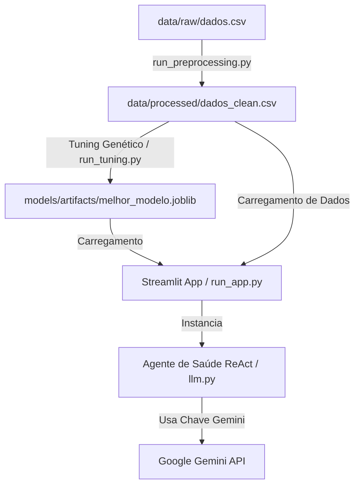

# Arquitetura do Projeto - Fase 2

Este documento descreve a arquitetura do sistema de análise e previsão de estado nutricional baseado em dados do SISVAN, detalhando a estrutura de pastas real do projeto, o fluxo do pipeline de dados e a arquitetura do agente de Inteligência Artificial para apoio clínico.

---

## 📂 Estrutura de Pastas e Componentes

A estrutura de diretórios do projeto divide-se em componentes reais (já implementados) e estruturais/planejados para as próximas entregas da Fase 2:

```
project-root/
├── README.md               # Instruções gerais de instalação e setup
├── requirements.txt        # Dependências em formato clássico txt
├── pyproject.toml          # Configurações do projeto e dependências do UV
├── uv.lock                 # Trava de dependências do UV
├── .env.example            # Modelo de configuração de ambiente
├── .gitignore              # Filtros de versionamento do Git
│
├── config/                 # Configurações centralizadas
│   └── __init__.py         # Módulo de inicialização (arquivos de config serão adicionados)
│
├── data/                   # Diretório de dados do pipeline
│   ├── raw/                # Base SISVAN bruta (dados originais)
│   ├── processed/          # Base processada e higienizada pós-pipeline
│   └── .gitkeep
│
├── models/                 # Diretório de artefatos de IA/ML
│   ├── artifacts/          # Modelos de Machine Learning e encoders salvos (.joblib)
│   ├── logs/               # Histórico de execução de logs do pipeline
│   └── cache/              # Dados cacheados intermediários
│
├── src/                    # Código-fonte principal da aplicação
│   ├── __init__.py
│   ├── data/               # Subsistema de dados e transformação
│   │   └── __init__.py     # Definição e exportação de funções de transformação
│   │
│   ├── models/             # Algoritmo genético e treinamento (planejado)
│   │   └── __init__.py
│   │
│   ├── app/                # Camada de apresentação e Agente LLM (Implementado)
│   │   ├── __init__.py
│   │   ├── llm.py          # Agente Inteligente ReAct (NutritionalHealthAgent)
│   │   └── pages/          # Telas adicionais e dashboards do Streamlit
│   │       └── __init__.py
│   │
│   └── utils/              # Funções utilitárias auxiliares
│       ├── __init__.py
│       ├── logger.py       # Sistema de logs centralizado
│       ├── persistence.py  # Funções de leitura/escrita de dados e modelos
│       └── validators.py   # Validação de tipos e restrições de dados do SISVAN
│
├── scripts/                # Scripts utilitários de linha de comando
│   ├── README.md           # Descrição dos scripts disponíveis
│   └── run_preprocessing.py # Script de execução do pré-processamento de dados
│
└── tests/                  # Suíte de testes automatizados
    ├── __init__.py
    ├── unit/               # Testes unitários (ex: test_llm_agent.py)
    └── integration/        # Testes de integração de fluxos (planejado)
```

---

## 🤖 Arquitetura do Agente de Saúde Nutricional

O agente de apoio à decisão clínica e estatística está implementado na classe [`NutritionalHealthAgent`](file:///c:/code/fiap-pos-ia/fase-2/fiap-pos-ia-para-devs-fase2-tech-challenge/src/app/llm.py) localizada em `src/app/llm.py`. 

### 1. Padrão de Projeto ReAct (Reasoning and Acting)
O agente utiliza o padrão **ReAct**, o qual alterna ciclos de raciocínio (Thought) e ações (Action) em cima de ferramentas para resolver perguntas complexas de dados de forma iterativa. Ele executa o seguinte fluxo:
1. Recebe a pergunta do usuário.
2. Analisa se precisa consultar estatísticas, filtrar dados de pacientes ou buscar diretrizes médicas.
3. Executa a ferramenta correta (**Action**) com o parâmetro adequado (**Action Input**).
4. Analisa a saída da ferramenta (**Observation**).
5. Se necessário, repete o ciclo ou formula a resposta final em português no formato padrão (**Final Answer**).

### 2. Integração com Google AI (Gemini) e LangChain
A integração do agente com a API do Gemini é construída usando a biblioteca `langchain_google_genai`:
* **Classe LLM**: `ChatGoogleGenerativeAI`.
* **Segurança da Chave**: A API Key do Gemini é fornecida no arquivo `.env` como `LLM_API_KEY`. Durante a inicialização do agente, ela é dinamicamente injetada na variável de ambiente local `GOOGLE_API_KEY`, garantindo a autenticação automática nos SDKs do Google sem expor segredos no código-fonte.
* **Memória**: Utiliza `ConversationBufferMemory` configurada para armazenar o histórico de mensagens em formato de string. Isso permite que o modelo recorde perguntas anteriores e mantenha uma conversação fluida e contínua.
* **Orquestração**: O agente é criado utilizando a função `create_react_agent` e encapsulado em um `AgentExecutor` configurado com `handle_parsing_errors=True` para tratar com segurança qualquer resposta fora do padrão ReAct esperado.

### 3. Ferramentas Disponíveis ao Agente (Tools)

O agente tem acesso a três ferramentas customizadas baseadas nos dados dos pacientes carregados:

*   **`get_nutrition_statistics`**:
    *   **Descrição**: Gera estatísticas descritivas básicas das colunas numéricas e calcula a frequência das classificações do estado nutricional (predições de ML).
    *   **Método interno**: `_tool_get_statistics()`.
*   **`filter_nutrition_records`**:
    *   **Descrição**: Permite a execução de consultas e filtros avançados nos dados utilizando a sintaxe nativa de queries do Pandas.
    *   **Método interno**: `_tool_filter_records(query)`. Limita automaticamente o resultado a 30 linhas para não ultrapassar a janela de contexto da API do LLM.
*   **`get_clinical_recommendations`**:
    *   **Descrição**: Fornece diretrizes e recomendações clínicas e dietéticas de referência baseadas em um diagnóstico de estado nutricional consultado (como Obesidade, Eutrofia, Sobrepeso ou Desnutrição/Baixo Peso).
    *   **Método interno**: `_tool_get_recommendations(category)`.

---

## ⚙️ Variáveis de Ambiente e Configuração

A inicialização dos componentes e conexões depende das variáveis configuradas no arquivo `.env`. As chaves críticas são:

| Variável | Descrição | Valor Padrão / Exemplo |
| :--- | :--- | :--- |
| `LLM_API_KEY` | Chave de API gerada no Google AI Studio | `AIzaSy...` |
| `LLM_MODEL` | Modelo Gemini utilizado para o agente | `gemini-2.5-flash` |
| `LLM_TEMPERATURE` | Nível de criatividade das respostas do agente | `0.7` |
| `DATA_PATH` | Caminho base dos arquivos de dados | `./data` |
| `MODEL_PATH` | Caminho de exportação de encoders e modelos | `./models/artifacts` |
| `LOG_LEVEL` | Nível de depuração do sistema | `INFO` |
| `RANDOM_SEED` | Semente para reprodutibilidade estocástica | `42` |

---

## 📈 Fluxo de Execução do Pipeline Geral

O processamento e interação com o sistema se desenvolvem em três etapas macro (algumas integradas na Fase 2):



1. **Pipeline de Dados**: O script `run_preprocessing.py` ingere o dataset bruto em CSV, remove gestantes (se ativado), realiza imputações necessárias, executa a engenharia de features e codifica colunas qualitativas, gravando os encoders criados.
2. **Treinamento e Tuning (Em Construção)**: Algoritmo Genético fará a busca de hiperparâmetros ótimos para o classificador de estado nutricional.
3. **Interface Visual e Agente**: O aplicativo Streamlit unificará o monitoramento das fases com uma tela dedicada de chat, onde o `NutritionalHealthAgent` usará a chave da API do Gemini para interpretar as predições de ML sobre a base de pacientes de forma inteligente.
