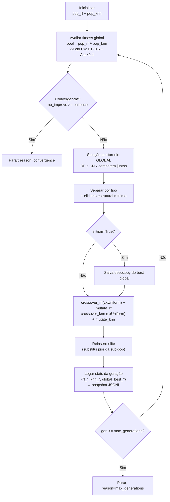
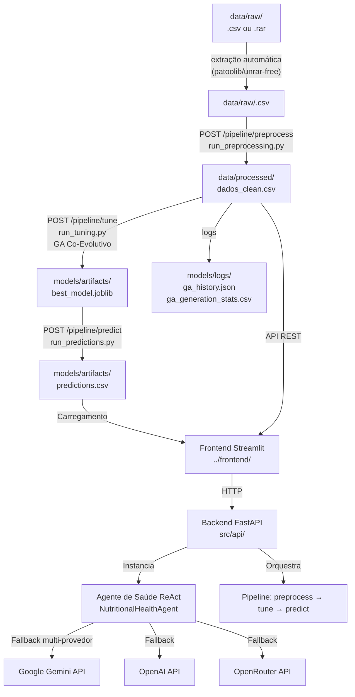

# Arquitetura do Projeto - Fase 2

Este documento descreve a arquitetura do sistema de análise e previsão de estado nutricional baseado em dados do SISVAN, detalhando a estrutura de pastas real do projeto, o fluxo do pipeline de dados e a arquitetura do agente de Inteligência Artificial para apoio clínico.

---

## 📂 Estrutura de Pastas e Componentes

```
project-root/
├── README.md                    # Instruções gerais de instalação e setup
├── docker-compose.yml           # Orquestração Docker (backend + frontend)
├── restart_containers.sh/.bat   # Scripts de reinicialização rápida
│
├── backend/
│   ├── README.md               # Instruções detalhadas do backend
│   ├── pyproject.toml          # Configurações do projeto e dependências (UV)
│   ├── uv.lock                 # Trava de dependências
│   ├── requirements.txt        # Dependências em formato clássico txt
│   ├── .env.example            # Modelo de configuração de ambiente
│   │
│   ├── config/                 # Configurações centralizadas
│   │   └── __init__.py
│   │
│   ├── data/                   # Diretório de dados do pipeline
│   │   ├── raw/                # Base SISVAN bruta (aceita .csv ou .rar)
│   │   └── processed/          # Base processada e higienizada pós-pipeline
│   │
│   ├── models/                 # Artefatos de IA/ML
│   │   ├── artifacts/          # Modelos sklearn e encoders salvos (.joblib, .json)
│   │   ├── logs/               # Histórico do GA (ga_history.json, ga_generation_stats.csv)
│   │   └── cache/              # Dados intermediários cacheados
│   │
│   ├── src/                    # Código-fonte principal
│   │   ├── agents/             # Agente LLM ReAct
│   │   │   └── nutritional_agent.py  # NutritionalHealthAgent + PatchedChatOpenAI
│   │   │
│   │   ├── api/                # FastAPI — rotas REST
│   │   │   ├── main.py           # Inicialização FastAPI + CORS
│   │   │   ├── job_store.py      # Store em memória para jobs assíncronos
│   │   │   ├── pipeline_store.py # Estado e ordenação das etapas do pipeline
│   │   │   ├── session_store.py  # Gerência de sessões do agente LLM
│   │   │   └── routes/
│   │   │       ├── health.py     # GET /health
│   │   │       ├── pipeline.py   # POST /pipeline/preprocess|tune|predict
│   │   │       ├── tuning.py     # POST /tuning/run, GET /tuning/datasets|jobs|logs
│   │   │       └── llm.py        # POST /llm/session|chat
│   │   │
│   │   ├── data/               # Subsistema de dados e transformação
│   │   │   ├── ingest.py       # Ingestão CSV + extração .rar (patoolib)
│   │   │   ├── features.py     # Engenharia de features e codificação
│   │   │   └── preprocessing.py # Pipeline de pré-processamento
│   │   │
│   │   ├── models/             # Algoritmo genético co-evolutivo
│   │   │   ├── individuo.py        # Hierarquia Individuo (ABC), IndividuoRF, IndividuoKNN
│   │   │   ├── ga_operators.py     # Crossover uniforme e mutação por agressividade
│   │   │   ├── ga_evaluator.py     # Fitness com k-Fold CV (F1×0.6 + Acc×0.4)
│   │   │   ├── genetic_algorithm.py # Loop co-evolutivo + parada dupla
│   │   │   └── ga_persistence.py   # Save/load de resultados GA e modelos
│   │   │
│   │   ├── services/           # Lógica de negócio da API
│   │   │   └── tuning_service.py
│   │   │
│   │   └── utils/              # Funções utilitárias
│   │       ├── logger.py       # Sistema de logs centralizado
│   │       ├── persistence.py  # Leitura/escrita de dados e modelos
│   │       └── validators.py   # Validação de tipos e restrições SISVAN
│   │
│   ├── scripts/                # Scripts CLI
│   │   ├── run_preprocessing.py # Pré-processamento dos dados brutos
│   │   ├── run_tuning.py        # CLI do GA Co-Evolutivo
│   │   ├── run_predictions.py   # Gera predições com o modelo treinado
│   │   └── validate_tools.py    # Teste interativo das ferramentas do agente (mock LLM)
│   │
│   ├── docs/                   # Documentação do projeto (dentro do backend)
│   │   ├── architecture.md     # Este arquivo
│   │   ├── adr.md              # Architecture Decision Records
│   │   └── resumo-melhorias-agente-llm-fallback.md  # Histórico de decisões do agente LLM
│   │
│   └── tests/                  # Suíte de testes (313 testes)
│       ├── unit/               # Testes unitários (13 arquivos)
│       │   ├── test_ga_operators.py    # Crossover, mutação por agressividade
│       │   ├── test_ga_evaluator.py    # Fitness, fallback mock, k_folds
│       │   ├── test_ga_persistence.py  # Save/load de resultados e histórico
│       │   ├── test_ga_snapshot.py     # Snapshots incrementais de gerações
│       │   ├── test_individuo.py       # IndividuoRF, IndividuoKNN, build_model
│       │   ├── test_features.py        # Engenharia de features
│       │   ├── test_preprocessing.py   # Pipeline de pré-processamento
│       │   ├── test_ingest.py          # Ingestão CSV e extração .rar
│       │   ├── test_api_stores.py      # JobStore, PipelineStore, SessionStore
│       │   ├── test_services.py        # TuningService e lógica de negócio
│       │   ├── test_utils.py           # Logger, persistence, validators
│       │   └── test_llm_agent.py       # Agente ReAct, fallback multi-provedor, PatchedChatOpenAI
│       │
│       └── integration/        # Testes de integração (4 arquivos)
│           ├── test_ga_optimizer.py    # GA Co-Evolutivo end-to-end
│           ├── test_api_pipeline.py    # Pipeline REST assíncrono
│           ├── test_api_routes.py      # Rotas gerais da API
│           └── test_api_tuning.py      # Rotas de tuning
│
├── frontend/
│   ├── README.md               # Instruções detalhadas do frontend
│   ├── pyproject.toml
│   ├── .env.example
│   │
│   ├── app/
│   │   ├── main.py             # Página inicial (status da API + navegação)
│   │   └── pages/
│   │       ├── 01_preprocessing.py  # Console de pré-processamento com logs em tempo real
│   │       ├── 02_tuning.py         # Dashboard GA Co-Evolutivo (gráficos Plotly incrementais)
│   │       ├── 03_predictions.py    # Visualização de predições do modelo
│   │       ├── 04_llm_chat.py       # Chat com o Agente de Saúde Nutricional
│   │       ├── 04_model_comparison.py  # Comparação de modelos RF vs KNN
│   │       └── 05_pipeline_explanation.py  # Explicação do pipeline para o usuário
│   │
│   └── src/
│       └── api_client.py       # Cliente HTTP para o backend
│
├── docs/                       # Documentação raiz do projeto
│   ├── architecture.md         # Arquitetura técnica detalhada (este arquivo)
│   ├── adr.md                  # Architecture Decision Records
│   ├── gap_analysis.md         # Análise de gaps do projeto
│   └── resumo-melhorias-agente-llm-fallback.md  # Histórico de melhorias do agente LLM
│
└── experiments/
    └── llm_quality_eval.md     # Avaliação qualitativa do agente (rubrica, perguntas-teste)
```

---

## 🤖 Arquitetura do Agente de Saúde Nutricional

O agente de apoio à decisão clínica está implementado na classe `NutritionalHealthAgent` em [`src/agents/nutritional_agent.py`](file:///home/luizbaroni/projetos/fiap/fiap-pos-ia-para-devs-fase2-tech-challenge/backend/src/agents/nutritional_agent.py).

### 1. Padrão de Projeto ReAct (Reasoning and Acting)

O agente utiliza o padrão **ReAct**, alternando ciclos de raciocínio (Thought) e ações (Action) em cima de ferramentas para resolver perguntas complexas:

1. Recebe a pergunta do usuário
2. Analisa se precisa consultar estatísticas, filtrar dados ou buscar diretrizes médicas
3. Executa a ferramenta correta (**Action**) com o parâmetro adequado (**Action Input**)
4. Analisa a saída da ferramenta (**Observation**)
5. Repete o ciclo ou formula a **Final Answer** em português

### 2. Fallback Multi-Provedor Stateful

O agente implementa um **fallback com memória de sessão** para alta disponibilidade:

```
LLM_PROVIDER_ORDER=gemini,openai,openrouter
```

- **`_built_llms`**: lista de todos os provedores instanciados na inicialização
- **`_active_index`**: índice do provedor ativo na sessão
- **`_advance_provider()`**: promove permanentemente para o próximo provedor ao detectar rate limit, timeout ou erro de servidor (sem voltar ao primário na mesma sessão)
- **Retry transparente**: a pergunta que sofreu falha é retentada automaticamente com o novo provedor antes de reportar erro ao usuário
- **HTTP 503**: se todos os provedores falharem, a rota `/llm/chat` retorna 503 (Service Unavailable) em vez de 500 genérico

Exceções que disparam avanço de provedor (`_FALLBACK_EXCEPTIONS`):
- `OpenAIRateLimitError`, `OpenAIConnectionError`, `OpenAITimeoutError`, `OpenAIInternalServerError`
- `GoogleAPICallError` (google-api-core)

### 3. PatchedChatOpenAI — Auto-Recovery de Parâmetro `stop`

Modelos de raciocínio da OpenAI (ex: `o1`, `o3-mini`, `gpt-5-nano`) e via OpenRouter não aceitam o parâmetro `stop` na API, mas o LangChain ReAct Agent o injeta por padrão.

A classe `PatchedChatOpenAI` resolve isso em duas camadas:

```
LangChain ReAct Agent
  └─► _generate(messages, stop=["Observation:"])
        └─► _get_request_payload(messages, stop=stop)   ← ponto real de injeção
              └─► {"messages": [...], "stop": [...]}    ← enviado para a API
```

- **`_get_request_payload`** (sobrescrito): remove `stop` do payload quando `drop_stop=True` — *antes* do payload ser enviado à API
- **`_generate`** (sobrescrito): intercepta `BadRequestError` com mensagem contendo `"stop"`, ativa `drop_stop=True` e retenta a chamada de forma transparente
- Configurável via `OPENAI_DROP_STOP=true` / `OPENROUTER_DROP_STOP=true` no `.env` para saltar o primeiro erro

### 4. Provedores Suportados

| Provedor | Classe | Variáveis de Ambiente |
|----------|--------|-----------------------|
| Google Gemini | `ChatGoogleGenerativeAI` | `GEMINI_API_KEY`, `GEMINI_MODEL`, `GEMINI_TEMPERATURE` |
| OpenAI | `PatchedChatOpenAI` | `OPENAI_API_KEY`, `OPENAI_MODEL`, `OPENAI_TEMPERATURE`, `OPENAI_DROP_STOP` |
| OpenRouter | `PatchedChatOpenAI` | `OPENROUTER_API_KEY`, `OPENROUTER_MODEL`, `OPENROUTER_TEMPERATURE`, `OPENROUTER_DROP_STOP` |

### 5. Ferramentas Disponíveis ao Agente (Tools)

| Ferramenta | Método Interno | Uso |
|---|---|---|
| `get_nutrition_statistics` | `_tool_get_statistics()` | Estatísticas descritivas + distribuição das predições de ML |
| `filter_nutrition_records` | `_tool_filter_records(query)` | Filtros com sintaxe `pandas.query` (limita a 30 linhas) |
| `get_clinical_recommendations` | `_tool_get_recommendations(category)` | Diretrizes clínicas por estado nutricional |

### 6. Memória e Histórico de Sessão

- **`ConversationBufferMemory`** (`memory_key="chat_history"`, `return_messages=False`): armazena o histórico completo como string formatada, injetada no prompt ReAct
- O histórico é mantido por sessão (instância do agente), persistido no `session_store.py` da API

---

## 🧬 Algoritmo Genético Co-Evolutivo

O módulo de tuning de hiperparâmetros está em `src/models/` e usa uma abordagem **co-evolutiva** com duas populações independentes: **RandomForest (RF)** e **KNeighborsClassifier (KNN)**.

### Hierarquia de Classes

```
Individuo (ABC)
├── IndividuoRF  → Pipeline([('clf', RandomForestClassifier(...))])
└── IndividuoKNN → Pipeline([('scaler', StandardScaler()), ('clf', KNN(...))])
```

> KNN inclui `StandardScaler` obrigatório pois é sensível à escala das features. RF é invariante à escala.

### Fluxo Co-Evolutivo por Geração


```mermaid
flowchart TD
    A["Inicializar\npop_rf + pop_knn"] --> B
    B["Avaliar fitness global\npool = pop_rf + pop_knn\nk-Fold CV: F1×0.6 + Acc×0.4"] --> C
    C{"Convergência?\nno_improve >= patience"}
    C -- Sim --> Z["Parar: reason=convergence"]
    C -- Não --> D
    D["Seleção por torneio GLOBAL\nRF e KNN competem juntos"] --> E
    E["Separar por tipo\n+ elitismo estrutural mínimo"] --> F
    F{"elitism=True?"}
    F -- Sim --> G["Salva deepcopy do best global"]
    F -- Não --> H
    G --> H
    H["crossover_rf (cxUniform) + mutate_rf\ncrossover_knn (cxUniform) + mutate_knn"] --> I
    I["Reinsere elite\n(substitui pior da sub-pop)"] --> J
    J["Logar stats da geração\n{rf_*, knn_*, global_best_*}\n→ snapshot JSONL"] --> K
    K{"gen >= max_generations?"}
    K -- Sim --> L["Parar: reason=max_generations"]
    K -- Não --> B
```

### Módulos do GA

| Módulo | Responsabilidade |
|---|---|
| `individuo.py` | Hierarquia `Individuo` → `IndividuoRF` / `IndividuoKNN` com pipeline sklearn |
| `ga_operators.py` | Geração aleatória, crossover uniforme (cxUniform em dicts nomeados), mutação com 3 níveis |
| `ga_evaluator.py` | `evaluate()` agnóstico ao tipo; `fitness_score()` = F1×0.6 + Acc×0.4 |
| `genetic_algorithm.py` | `GeneticAlgorithm`: loop co-evolutivo, parada dupla, elitismo configurável |
| `ga_persistence.py` | `save_ga_results()` (JSON + CSV), `save_best_model()` treina e persiste via joblib |

### Parâmetros Configuráveis

| Parâmetro | CLI | Default | Descrição |
|---|---|---|---|
| `pop_size` | `--pop-size` | 20 | Indivíduos por tipo (total = 2×) |
| `max_generations` | `--max-generations` | 10 | Critério de parada por limite |
| `patience` | `--patience` | 5 | Gerações sem melhoria → convergência |
| `k_folds` | `--k-folds` | 5 | Folds para Cross Validation |
| `mutation_aggressiveness` | `--aggressiveness` | `medium` | `low` / `medium` / `high` |
| `elitism` | `--elitism` / `--no-elitism` | `True` | Preserva melhor indivíduo |
| `indpb` | `--indpb` | 0.5 | Prob. de swap por gene (cxUniform) |
| `cxpb` | `--cxpb` | 0.7 | Prob. de crossover |
| `mutpb` | `--mutpb` | 0.3 | Prob. de mutação |
| `random_seed` | `--random-seed` | 42 | Semente para reprodutibilidade |
| `sample_size` | `--sample` | 50000 | Tamanho máximo da amostragem (0 = base completa) |

---

## ⚙️ Variáveis de Ambiente e Configuração

| Variável | Descrição | Valor Padrão / Exemplo |
| :--- | :--- | :--- |
| `LLM_PROVIDER_ORDER` | Ordem dos provedores LLM (vírgula separada) | `gemini,openai,openrouter` |
| `LLM_API_KEY` | Chave API Gemini (retrocompatibilidade) | `AIzaSy...` |
| `LLM_MODEL` | Modelo Gemini (retrocompatibilidade) | `gemini-2.5-flash` |
| `GEMINI_API_KEY` | Chave API Google Gemini | `AIzaSy...` |
| `GEMINI_MODEL` | Modelo Gemini a usar | `gemini-2.5-flash-lite` |
| `GEMINI_TEMPERATURE` | Criatividade das respostas Gemini | `0.7` |
| `OPENAI_API_KEY` | Chave API OpenAI | `sk-proj-...` |
| `OPENAI_MODEL` | Modelo OpenAI a usar | `gpt-4o` |
| `OPENAI_TEMPERATURE` | Criatividade das respostas OpenAI | `0.7` |
| `OPENAI_DROP_STOP` | Remove `stop` do payload (modelos de raciocínio) | `false` |
| `OPENROUTER_API_KEY` | Chave API OpenRouter | `sk-or-v1-...` |
| `OPENROUTER_MODEL` | Modelo via OpenRouter | `meta-llama/llama-3.3-70b-instruct:free` |
| `OPENROUTER_TEMPERATURE` | Criatividade das respostas OpenRouter | `0.7` |
| `OPENROUTER_DROP_STOP` | Remove `stop` do payload (modelos de raciocínio) | `false` |
| `DATA_PATH` | Caminho base dos arquivos de dados | `./data` |
| `MODEL_PATH` | Caminho de exportação de encoders e modelos | `./models/artifacts` |
| `LOG_LEVEL` | Nível de depuração do sistema | `INFO` |
| `RANDOM_SEED` | Semente para reprodutibilidade estocástica | `42` |
| `CORS_ORIGINS` | Origens permitidas pelo CORS | `http://localhost:8501` |

---

## 📈 Fluxo de Execução do Pipeline Geral


```mermaid
graph TD
    A["data/raw/\n.csv ou .rar"] -->|"extração automática\n(patoolib/unrar-free)"| A1["data/raw/.csv"]
    A1 -->|"POST /pipeline/preprocess\nrun_preprocessing.py"| B["data/processed/\ndados_clean.csv"]
    B -->|"POST /pipeline/tune\nrun_tuning.py\nGA Co-Evolutivo"| C["models/artifacts/\nbest_model.joblib"]
    B -->|logs| D2["models/logs/\nga_history.json\nga_generation_stats.csv"]
    C -->|"POST /pipeline/predict\nrun_predictions.py"| P["models/artifacts/\npredictions.csv"]
    P -->|"Carregamento"| D["Frontend Streamlit\n../frontend/"]
    B -->|"API REST"| D
    D -->|HTTP| API["Backend FastAPI\nsrc/api/"]
    API -->|Instancia| E["Agente de Saúde ReAct\nNutritionalHealthAgent"]
    API -->|Orquestra| F["Pipeline: preprocess → tune → predict"]
    E -->|"Fallback multi-provedor"| G1["Google Gemini API"]
    E -->|"Fallback"| G2["OpenAI API"]
    E -->|"Fallback"| G3["OpenRouter API"]
```

1. **Pipeline de Dados**: `POST /pipeline/preprocess` ingere CSV ou `.rar` (extração via `patoolib`), remove gestantes (se ativado), realiza imputações, executa engenharia de features e codifica colunas qualitativas.

2. **Treinamento e Tuning**: `POST /pipeline/tune` executa o **GA Co-Evolutivo** com duas populações (RF e KNN) competindo pelo fitness global (F1×0.6 + Acc×0.4 via k-Fold CV). A cada geração concluída, um snapshot é persistido em `/tmp/ag_job_{job_id}_generations.jsonl` para polling incremental pelo frontend. Artefatos finais: `best_model.joblib`, `ga_history.json`, `ga_generation_stats.csv`.

3. **Predições**: `POST /pipeline/predict` aplica o modelo treinado sobre os dados processados, gerando `predictions.csv`.

4. **Interface Visual e Agente**: O frontend Streamlit consome a API REST:
   - **🗂 Pré-processamento** (`01_preprocessing.py`): console de logs em tempo real via `/pipeline/jobs/{id}/logs`
   - **🧬 Tuning Genético** (`02_tuning.py`): dashboard com gráficos Plotly atualizados incrementalmente via `/tuning/jobs/{id}/generations`
   - **📊 Predições** (`03_predictions.py`): visualização do CSV de predições
   - **💬 Agente Nutricional** (`04_llm_chat.py`): chat ReAct via `/llm/session` e `/llm/chat`
   - **🔬 Comparação de Modelos** (`04_model_comparison.py`): comparativo RF vs KNN
   - **📖 Explicação do Pipeline** (`05_pipeline_explanation.py`): guia didático para o usuário

---

## 🔄 Pipeline API — Orquestração por Etapas

A rota `src/api/routes/pipeline.py` expõe um pipeline orquestrado em 3 etapas com jobs assíncronos. Cada etapa é acionada por `POST` e monitorada via polling em `GET /pipeline/jobs/{job_id}`.

### Endpoints

| Método | Rota | Pré-requisito | Descrição |
|--------|------|----------------|----------|
| `POST` | `/pipeline/preprocess` | `.csv` ou `.rar` em `data/raw/` | Pré-processamento completo |
| `POST` | `/pipeline/tune` | `preprocess` concluído | GA Co-Evolutivo com snapshots em tempo real |
| `POST` | `/pipeline/predict` | `tune` concluído | Gera `predictions.csv` com o melhor modelo |
| `GET` | `/pipeline/status` | — | Estado atual de cada etapa |
| `GET` | `/pipeline/jobs/{id}` | — | Status e resultado de um job |
| `GET` | `/pipeline/jobs/{id}/logs` | — | Logs de execução do pré-processamento |
| `GET` | `/tuning/jobs/{id}/generations` | — | Snapshots incrementais de gerações (polling) |
| `POST` | `/llm/session` | — | Cria sessão do agente LLM (upload CSV) |
| `POST` | `/llm/chat` | Sessão ativa | Pergunta ao agente ReAct |

### Padrão de Job Assíncrono com Monitoramento em Tempo Real

1. O frontend inicia a operação:
   ```
   POST /pipeline/preprocess ou POST /pipeline/tune (assíncrono)
     → retorna { "job_id": "uuid" } imediatamente
   ```

2. Enquanto o job executa no backend:
   - **Tuning (GA):** a cada geração concluída, um snapshot é persistido em JSONL. O frontend faz polling em `GET /tuning/jobs/{job_id}/generations?since=N` e renderiza gráficos incrementalmente.
   - **Pré-processamento:** `scripts/run_preprocessing.py` é iniciado via `subprocess.Popen` com redirecionamento de stdout/stderr para `/tmp/preprocessing_{job_id}.log`. O frontend lê esses logs via `GET /pipeline/jobs/{job_id}/logs`.

3. Quando o job conclui:
   - Os endpoints de monitoramento retornam `"completed"` ou `"failed"`
   - O frontend interrompe o ciclo de polling e exibe o estado final

---

## 🧪 Estratégia de Testes

A suíte conta com **313 testes** no total, validando comportamento correto organizado em duas camadas:

### Testes Unitários (`tests/unit/`)

| Arquivo | Área | Destaques |
|---|---|---|
| `test_ga_operators.py` | Operadores genéticos | crossover (indpb=0/0.5/1.0), mutação por magnitude (high ≥ medium ≥ low) |
| `test_ga_evaluator.py` | Evaluator | fallback `(0.0, 0.0)`, propagação correta de k_folds |
| `test_ga_persistence.py` | Persistência GA | Save/load JSON+CSV, histórico de gerações |
| `test_ga_snapshot.py` | Snapshots | Snapshots incrementais em JSONL durante o tuning |
| `test_individuo.py` | Indivíduo | IndividuoRF, IndividuoKNN, build_model, pipeline sklearn |
| `test_features.py` | Engenharia de features | Codificação de categorias, imputação |
| `test_preprocessing.py` | Pré-processamento | Limpeza, remoção de gestantes, padronização |
| `test_ingest.py` | Ingestão | Leitura CSV, extração .rar |
| `test_api_stores.py` | Stores da API | JobStore, PipelineStore, SessionStore |
| `test_services.py` | Services | TuningService, lógica de negócio |
| `test_utils.py` | Utilitários | Logger, persistence, validators |
| `test_llm_agent.py` | Agente LLM | Inicialização, fallback multi-provedor, PatchedChatOpenAI auto-recovery, ferramentas ReAct |

### Testes de Integração (`tests/integration/`)

| Arquivo | Área | Destaques |
|---|---|---|
| `test_ga_optimizer.py` | GA end-to-end | Elitismo/monotonia, torneio, convergência, reprodutibilidade por seed |
| `test_api_pipeline.py` | Pipeline REST | Jobs assíncronos, logs, orquestração de etapas |
| `test_api_routes.py` | Rotas gerais | Health check, endpoints de dataset, estrutura de respostas |
| `test_api_tuning.py` | Rotas de tuning | Execução GA via API, polling de gerações |
