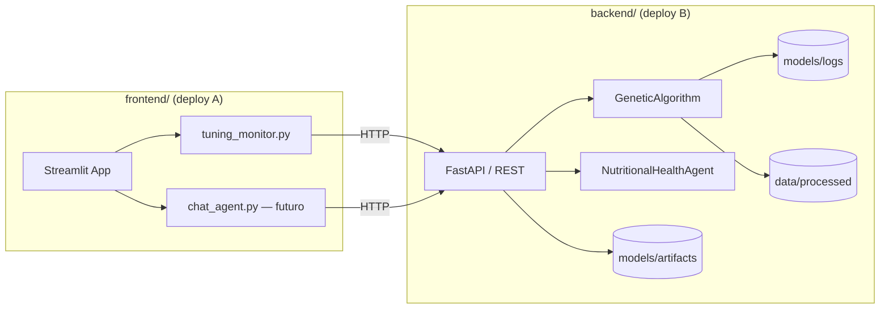

# Plano de Migração: Front-end → `frontend/`

> **Objetivo:** separar a camada de apresentação (Streamlit) do backend Python/ML, permitindo **deploys independentes** de cada projeto.
>
> **Escopo inicial:** conteúdo hoje em `backend/src/app/pages/` e, por extensão, toda a camada de UI prevista em `backend/src/app/`.

---

## 1. Situação atual

### 1.1 Estrutura relevante

```
backend/
├── src/
│   ├── app/
│   │   ├── llm.py                  # Agente ReAct (lógica + LangChain) — ainda sem UI
│   │   └── pages/
│   │       └── tuning_monitor.py   # Dashboard Streamlit do GA Co-Evolutivo
│   ├── models/                     # GA, fitness, persistência
│   ├── data/                       # Pipeline de dados
│   └── utils/
├── models/artifacts/               # best_model.joblib, encoders.joblib
├── models/logs/                    # ga_history.json, ga_generation_stats.csv
├── data/processed/                 # CSV processado
├── pyproject.toml                  # inclui streamlit, plotly, langchain, sklearn...
└── tests/unit/test_llm_agent.py    # testa src.app.llm
```

### 1.2 Acoplamentos críticos

| Arquivo | Dependência direta do backend | Impacto no split |
|---------|------------------------------|------------------|
| `tuning_monitor.py` | `from src.models.genetic_algorithm import GeneticAlgorithm` | GA roda **in-process** no mesmo processo Streamlit |
| `tuning_monitor.py` | Leitura local de CSV (`data/processed/...`) | Caminho de arquivo assume filesystem compartilhado |
| `tuning_monitor.py` | `pandas`, `plotly`, `streamlit` | Mistura UI + compute + I/O |
| `llm.py` | LangChain, Gemini, pandas | Deve ficar no backend; front só consome API |

**Conclusão:** mover apenas os arquivos de `pages/` para `frontend/` **não basta** para deploys separados. É necessário introduzir uma **camada de API REST** no backend e transformar o front-end em **cliente HTTP**.

---

## 2. Arquitetura alvo



### 2.1 Princípios

1. **Backend** expõe contratos HTTP estáveis; não importa Streamlit.
2. **Frontend** contém apenas UI, chamadas HTTP e visualização (Plotly).
3. **Segredos** (`LLM_API_KEY`) ficam **somente** no backend.
4. **Artefatos pesados** (CSV, `.joblib`, logs GA) permanecem no backend ou em storage compartilhado (S3, volume montado).

### 2.2 Estrutura de pastas proposta

```
fiap-pos-ia-para-devs-fase2-tech-challenge/
├── backend/                        # Deploy B — API + ML + scripts CLI
│   ├── src/
│   │   ├── api/                    # NOVO — rotas FastAPI
│   │   │   ├── __init__.py
│   │   │   ├── main.py             # app FastAPI + CORS
│   │   │   ├── routes/
│   │   │   │   ├── tuning.py       # POST /tuning/run, GET /tuning/status
│   │   │   │   ├── llm.py          # POST /llm/chat, POST /llm/upload
│   │   │   │   └── health.py       # GET /health
│   │   │   └── schemas/            # Pydantic request/response
│   │   ├── agents/                 # MOVER de src/app/llm.py
│   │   │   └── nutritional_agent.py
│   │   ├── models/                 # GA (sem alteração de lógica)
│   │   ├── data/
│   │   └── utils/
│   ├── scripts/                    # run_preprocessing, run_tuning (CLI)
│   ├── pyproject.toml              # REMOVER streamlit, plotly
│   └── Dockerfile
│
├── frontend/                       # Deploy A — Streamlit
│   ├── app/
│   │   ├── main.py                 # Entry point Streamlit (home)
│   │   └── pages/
│   │       ├── tuning_monitor.py   # MOVIDO — consome API
│   │       └── chat_agent.py       # FUTURO — consome API
│   ├── src/
│   │   └── api_client.py           # Cliente HTTP tipado (httpx/requests)
│   ├── pyproject.toml              # streamlit, plotly, httpx, pandas (leve)
│   ├── .env.example                # BACKEND_URL=http://localhost:8000
│   └── Dockerfile
│
├── docs/
│   └── plan-frontend-migration.md  # Este documento
└── docker-compose.yml              # Orquestração local (opcional)
```

---

## 3. Contratos de API (backend)

Endpoints mínimos para substituir os imports diretos atuais.

### 3.1 Tuning Genético

| Método | Rota | Descrição |
|--------|------|-----------|
| `GET` | `/health` | Health check para load balancer |
| `GET` | `/tuning/datasets` | Lista datasets processados disponíveis |
| `POST` | `/tuning/run` | Dispara execução do GA (sync ou async) |
| `GET` | `/tuning/jobs/{job_id}` | Status e resultados de job assíncrono |
| `GET` | `/tuning/logs/latest` | Retorna `ga_history.json` + stats CSV |

**Request body (`POST /tuning/run`):**

```json
{
  "dataset": "estado_nutricional_clean.csv",
  "target_col": "TARGET",
  "pop_size": 20,
  "max_generations": 10,
  "patience": 5,
  "k_folds": 5,
  "aggressiveness": "medium",
  "elitism": true,
  "cxpb": 0.7,
  "mutpb": 0.3,
  "indpb": 0.5,
  "random_seed": 42
}
```

**Response:** espelhar o dict retornado hoje por `GeneticAlgorithm.run()` (`best_individual`, `generations_stats`, `params`, etc.).

> **Decisão de design:** execuções longas (>30s) devem usar **jobs assíncronos** (BackgroundTasks ou fila Celery/RQ). O Streamlit faz polling em `GET /tuning/jobs/{id}` com spinner.

### 3.2 Agente LLM (futuro)

| Método | Rota | Descrição |
|--------|------|-----------|
| `POST` | `/llm/session` | Cria sessão com upload de CSV + mappings |
| `POST` | `/llm/chat` | Envia pergunta; retorna resposta ReAct |
| `DELETE` | `/llm/session/{id}` | Encerra sessão / libera memória |

---

## 4. Fases de implementação

### Fase 0 — Preparação (sem mover código)

- [x] Criar pasta `frontend/` com `pyproject.toml` mínimo (streamlit, plotly, httpx, pandas).
- [x] Adicionar `fastapi`, `uvicorn[standard]` ao `backend/pyproject.toml`.
- [x] Definir variáveis de ambiente:
  - Backend: `LLM_API_KEY`, `DATA_PATH`, `MODEL_PATH`, `CORS_ORIGINS`
  - Frontend: `BACKEND_URL` (ex.: `http://localhost:8000`)
- [x] Criar `docker-compose.yml` para desenvolvimento local com dois serviços.

**Estimativa:** 0,5–1 dia

---

### Fase 1 — API de Tuning no backend

- [ ] Criar `backend/src/api/main.py` com FastAPI + middleware CORS.
- [ ] Implementar `POST /tuning/run` reutilizando `GeneticAlgorithm` existente.
- [ ] Implementar `GET /health` e `GET /tuning/logs/latest`.
- [ ] Extrair lógica de carregamento de CSV para serviço reutilizável (`src/services/tuning_service.py`).
- [ ] Adicionar testes de integração da API (`tests/integration/test_api_tuning.py`).
- [ ] Documentar OpenAPI em `/docs` (Swagger automático do FastAPI).

**Estimativa:** 2–3 dias

---

### Fase 2 — Mover e refatorar `tuning_monitor.py`

- [ ] Copiar `backend/src/app/pages/tuning_monitor.py` → `frontend/app/pages/tuning_monitor.py`.
- [ ] Criar `frontend/src/api_client.py` com métodos `run_tuning()` e `get_latest_logs()`.
- [ ] Substituir imports `from src.models...` por chamadas HTTP.
- [ ] Substituir leitura local de CSV por seleção de dataset via API (ou upload futuro).
- [ ] Criar `frontend/app/main.py` como página inicial Streamlit.
- [ ] Remover `backend/src/app/pages/tuning_monitor.py`.
- [ ] Validar localmente:
  ```bash
  # Terminal 1 — backend
  cd backend && uv run uvicorn src.api.main:app --reload --port 8000

  # Terminal 2 — frontend
  cd frontend && uv run streamlit run app/main.py --server.port 8501
  ```

**Estimativa:** 1–2 dias

---

### Fase 3 — Mover agente LLM para backend

- [ ] Mover `backend/src/app/llm.py` → `backend/src/agents/nutritional_agent.py`.
- [ ] Atualizar imports em `tests/unit/test_llm_agent.py`.
- [ ] Implementar rotas `/llm/session` e `/llm/chat`.
- [ ] Criar `frontend/app/pages/chat_agent.py` (UI de chat Streamlit).
- [ ] Remover pasta `backend/src/app/` se vazia.

**Estimativa:** 2–3 dias

---

### Fase 4 — Limpeza de dependências

**Remover do `backend/pyproject.toml`:**

- `streamlit`
- `plotly` (se não usado em scripts/notebooks)
- `matplotlib`, `seaborn` (avaliar uso em scripts; manter se necessário)

**Manter no `frontend/pyproject.toml`:**

- `streamlit`, `plotly`, `pandas`, `httpx`

**Atualizar documentação:**

- [ ] `backend/README.md` — instruções da API
- [ ] `frontend/README.md` — instruções do Streamlit
- [ ] `backend/docs/architecture.md` — diagrama com dois deploys

**Estimativa:** 0,5 dia

---

### Fase 5 — Deploy separado

#### Backend (exemplos)

| Plataforma | Observação |
|------------|------------|
| **Railway / Render / Fly.io** | Container com `uvicorn`; volume para `data/` e `models/` |
| **AWS ECS / GCP Cloud Run** | Imagem Docker; secrets via Parameter Store / Secret Manager |
| **Azure Container Apps** | Similar |

**Dockerfile backend (esboço):**

```dockerfile
FROM python:3.13-slim
WORKDIR /app
COPY . .
RUN pip install uv && uv sync --frozen
EXPOSE 8000
CMD ["uv", "run", "uvicorn", "src.api.main:app", "--host", "0.0.0.0", "--port", "8000"]
```

#### Frontend

| Plataforma | Observação |
|------------|------------|
| **Streamlit Community Cloud** | Apontar `BACKEND_URL` para URL pública do backend |
| **Container próprio** | `streamlit run app/main.py --server.port 8501` |

**Variáveis no deploy do frontend:**

```env
BACKEND_URL=https://api.seu-dominio.com
```

**CORS no backend:**

```env
CORS_ORIGINS=https://app.seu-dominio.com,http://localhost:8501
```

**Estimativa:** 1–2 dias (inclui CI/CD)

---

## 5. Refatoração de `tuning_monitor.py` (detalhe)

### Antes (acoplado)

```python
from src.models.genetic_algorithm import GeneticAlgorithm
# ...
ga = GeneticAlgorithm(X=X, y=y, ...)
results = ga.run()
```

### Depois (desacoplado)

```python
from src.api_client import TuningClient

client = TuningClient(base_url=os.getenv("BACKEND_URL"))
results = client.run_tuning(
    dataset="estado_nutricional_clean.csv",
    target_col=target_col,
    pop_size=pop_size,
    # ... demais parâmetros da sidebar
)
```

A lógica de gráficos Plotly (`_make_evolution_chart`, `_make_population_chart`) **permanece no frontend** — apenas dados JSON trafegam pela rede.

---

## 6. Gestão de dados e artefatos

| Recurso | Onde fica | Como o front acessa |
|---------|-----------|---------------------|
| CSV processado | Backend (`data/processed/`) | API lista/seleciona dataset |
| `best_model.joblib` | Backend (`models/artifacts/`) | API de inferência futura |
| Logs GA | Backend (`models/logs/`) | `GET /tuning/logs/latest` ou download via API |
| Chave Gemini | Backend (`.env`) | Nunca exposta ao frontend |

Para produção, considerar **object storage** (S3/GCS) em vez de filesystem local, com o backend como único ponto de acesso.

---

## 7. Testes

| Camada | Tipo | O quê validar |
|--------|------|---------------|
| Backend | Unitário | GA, agente LLM (já existem) |
| Backend | Integração API | `POST /tuning/run` com dataset pequeno |
| Frontend | Manual / E2E | Streamlit renderiza gráficos com mock da API |
| Contrato | Opcional | Pact / schema OpenAPI vs `api_client.py` |

Adicionar fixture de resposta GA em `frontend/tests/fixtures/ga_results.json` para testes offline da UI.

---

## 8. Riscos e mitigações

| Risco | Mitigação |
|-------|-----------|
| Timeout HTTP em tuning longo | Jobs assíncronos + polling ou WebSocket de progresso |
| CORS bloqueando chamadas | Configurar `CORSMiddleware` com origens explícitas |
| Streamlit Cloud sem acesso a rede interna | Backend com URL pública HTTPS |
| Duplicação de `pandas` nos dois projetos | Aceitável; front usa pandas só para DataFrames de exibição |
| Regressão nos 60 testes existentes | Rodar `pytest` no backend após cada fase; não mover testes do LLM para frontend |

---

## 9. Checklist de conclusão

- [x] `backend/src/app/pages/` removida
- [x] `backend/src/app/llm.py` movido para `backend/src/agents/`
- [x] `frontend/app/pages/tuning_monitor.py` funcional via API
- [x] `streamlit` removido das dependências do backend
- [x] Dois Dockerfiles (ou compose) com deploy independente
- [x] READMEs atualizados
- [x] `architecture.md` reflete arquitetura de dois serviços
- [ ] CI executa testes backend e lint frontend separadamente

---

## 10. Ordem de execução recomendada

```
Fase 0 → Fase 1 → Fase 2 → Fase 4 (deps) → Fase 5 (deploy)
                              ↓
                           Fase 3 (LLM UI — pode ser paralela após Fase 1)
```

**MVP para deploy separado:** Fases 0 + 1 + 2 + 4 + 5 (tuning monitor funcionando via API).

**Entrega completa:** incluir Fase 3 (chat com agente nutricional).

---

## 11. Referências internas

- [`backend/docs/architecture.md`](../backend/docs/architecture.md) — visão atual monolítica
- [`backend/docs/plan-fluxo2-training-and-tunning.md`](../backend/docs/plan-fluxo2-training-and-tunning.md) — plano original do GA + Streamlit
- [`backend/src/app/pages/tuning_monitor.py`](../backend/src/app/pages/tuning_monitor.py) — UI a ser migrada
- [`backend/src/app/llm.py`](../backend/src/app/llm.py) — agente a expor via API
